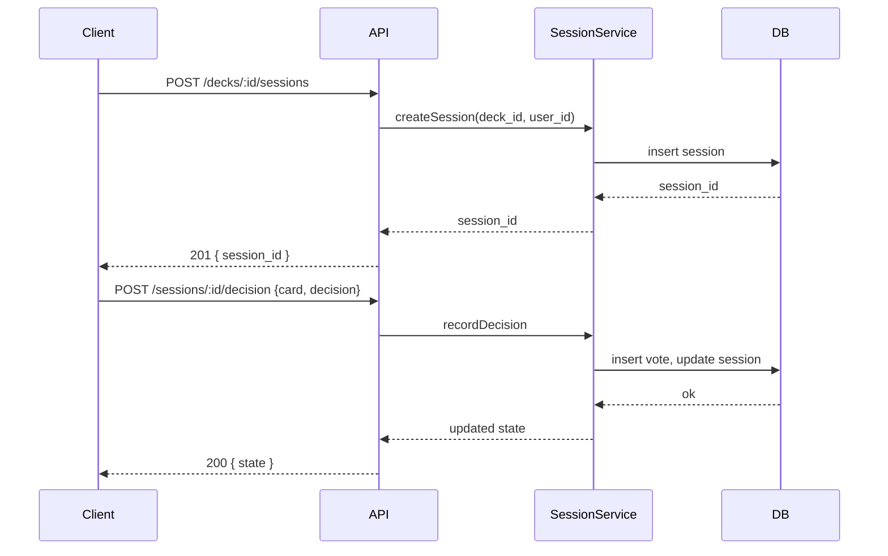

# pick-me-
## список фич
1. Добавление кандидатов карточек
- Создание нового списка карточек
- Содержимое карточки
2. Выбор первого уровня смаш пас
- список карточек
- -список положительно отобранных карточек
- -список негативно отобранных карточек
3. Повторный смаш ор пас
- список положительно отобранных
- -список негативно отобранных
4. Выбор второго уровня батл из двух
- список положительно отобранных карточек
- -список негативно отобранных карточек
- переформировка батла при трудном выборе

# PickMe — Спецификация архитектуры

Дата: 2025-11-16
Версия: 0.1 (MVP)

---

## 1. Краткое описание

**PickMe** — мобильное/веб приложение для помощи в выборе: пользователь создаёт список вариантов (карточки), отсекает их на уровнях (Tinder-style Smash/Pass, батлы 1‑на‑1 и т.д.) до получения одного финального варианта.

Цель спецификации — дать чёткое архитектурное описание для реализации MVP на хакатоне и дальнейшего масштабирования.

---

## 2. Требования

### Функциональные

* Регистрация/авторизация (опционально — гостевой режим).
* Создание/редактирование/удаление наборов карточек (deck).
* Просмотр карточек и первичный фильтр (swipe: smash/pass).
* Повторный фильтр и батлы (pairwise battle).
* Рандомизация пар для батлов; возможность турнирного режима.
* Сохранение истории выбора и финального результата.
* Экспорт/импорт списков (CSV/JSON) — опционально для MVP.
* Локальное хранение для оффлайн-режима (частичное).

### Нефункциональные

* Быстрая реакция UI (60fps для свайпов в мобильной реализаии).
* Масштабируемость (горизонтальное масштабирование backend).
* Безопасность пользовательских данных.
* Поддержка одновременной работы многих пользователей (хакатон: минимум 100-1000).

---

## 3. Архитектурный обзор (высокоуровневый)

Система состоит из следующих слоёв:

1. **Клиент (frontend)** — мобильное приложение (React Native) и/или SPA (React) для веба.
2. **API‑слой (backend)** — REST/GraphQL сервис для бизнес-логики.
3. **Хранилище данных** — основная БД (Postgres) + кеш (Redis) + файловое хранилище (S3 compatible) для изображений.
4. **Реaltime / очередь** — WebSocket / сокет-сервис (Socket.IO) и очередь задач (RabbitMQ / Redis Streams) для фоновых задач.
5. **Аутентификация** — JWT + OAuth2 (Google/Apple) для удобства.
6. **Инфраструктура и CI/CD** — Docker, Kubernetes (k8s) или Vercel/Heroku для быстрого деплоя.

```mermaid
flowchart LR
  A[Frontend (React/React Native)] -->|HTTP/GraphQL| B(API Gateway)
  B --> C[Backend Services]
  C --> D[(Postgres)]
  C --> E[(Redis Cache)]
  C --> F[(S3 Storage)]
  B --> G[Auth Service]
  C --> H[Message Queue]
  H --> I[Worker Service]
  A --> J[WebSocket / Realtime]
```

---

## 4. Компоненты и ответственность

### 4.1 Frontend

* Экран списка наборов (Decks)
* Редактор карточки (Card editor)
* Экран свайпов (SwipeView)
* Экран батлов (DuelView)
* Экран результата (WinnerView)

Требования:

* Управление состоянием (Redux / Zustand / MobX).
* Локальное кэширование (IndexedDB / AsyncStorage).
* Поддержка анимаций для плавного ощущения свайпа.

### 4.2 Backend

* **API Gateway** — маршрутизация, rate limiting, логирование.
* **Deck Service** — CRUD для наборов и карточек.
* **Session Service** — хранит состояние текущей сессии выбора (progression, history, decisions).
* **Match Service** — логика батлов, алгоритмы турнира/ранжирования.
* **Auth Service** — регистрация, логин, интеграции.
* **Worker Service** — фоновые задания (генерация пар, отправка уведомлений, экспорт).

### 4.3 DB / Storage

* Postgres — основные сущности (users, decks, cards, sessions, votes).
* Redis — быстрый access для сессий и временных данных (TTL), очередь задач.
* S3 — хранение изображений/медиа карточек.

---

## 5. Схема данных (предложение)

### User

```
id: UUID
email: string
display_name: string
provider: enum (local/google/apple)
created_at, updated_at
```

### Deck

```
id: UUID
user_id: UUID
title: string
description: text
privacy: enum (private/public)
created_at, updated_at
```

### Card

```
id: UUID
deck_id: UUID
title: string
description: text
image_url: string (nullable)
metadata: jsonb (tags, calories, etc.)
position: int (optional)
created_at, updated_at
```

### Session (временная сессия выбора)

```
id: UUID
deck_id: UUID
user_id: UUID (nullable for guest)
remaining_cards: jsonb or relation
passed_cards: jsonb
smashed_cards: jsonb
mode: enum (swipe, duel, tournament)
status: enum (active, finished)
created_at, updated_at
```

### Vote / Decision (лог каждой оценки)

```
id
session_id
card_id
decision: enum (pass, smash, chosen)
round: int
timestamp
```

---

## 6. API (REST) — примеры основных endpoint'ов

> Базовый путь: `/api/v1`

### Auth

* `POST /auth/signup` — регистрация
* `POST /auth/login` — логин
* `POST /auth/oauth` — OAuth callback

### Decks / Cards

* `GET /decks` — список наборов
* `POST /decks` — создать набор
* `GET /decks/:id` — получить набор
* `PUT /decks/:id` — обновить
* `DELETE /decks/:id` — удалить
* `POST /decks/:id/cards` — добавить карточку
* `PUT /cards/:id` — обновить карточку
* `DELETE /cards/:id` — удалить карточку

### Sessions / Flow

* `POST /decks/:id/sessions` — создать сессию выбора (возвращает session_id)
* `POST /sessions/:id/decision` — отправить решение для карточки `{ card_id, decision }`
* `GET /sessions/:id/state` — текущий стейт сессии (оставшиеся карточки и т.д.)
* `POST /sessions/:id/duel` — запрос пары для дуэли (возвращает две карточки)
* `POST /sessions/:id/finish` — завершить сессию

### Exports

* `GET /decks/:id/export?format=csv|json` — экспорт

---

## 7. Бизнес-логика — важные алгоритмы

### 7.1 Первичный фильтр (swipe)

* По умолчанию пользователь проходит линейно по списку карточек.
* Решения записываются в Session + Vote.
* После первого прохода остаются только карты со статусом `smashed`.

### 7.2 Батл 1‑на‑1 (duel)

* Подготовка пар: случайная пара из `smashed` или алгоритм турнира.
* Пользователь выбирает предпочтение — проигравший помечается как `pass`, победитель остаётся.
* Повторять до одной карточки.

### 7.3 Турнирный режим (опционально)

* Генерировать турнирную сетку N -> ceil(N/2) и т.д.
* Учитывать веса/рейтинг карточек из `metadata`.

---

## 8. Offline-first / локальное хранение

* Сохранять созданные decks и их изменения в local DB (IndexedDB / AsyncStorage).
* Синхронизация через background sync: при восстановлении соединения отправлять изменения на сервер.
* Конфликты: last-write-wins или merge на уровне полей (для MVP — last-write-wins).

---

## 9. Realtime и уведомления

* WebSocket для отображения прогресса реального времени (чтобы, например, другой пользователь мог смотреть чужую сессию) — опционально.
* Push-уведомления при завершении сессии или по расписанию.

---

## 10. Безопасность и приватность

* Хранение паролей: bcrypt/argon2 хэш.
* HTTPS everywhere (TLS).
* Приватные decks держать приватными: проверять user_id при запросах.
* Rate limiting и защита от брутфорса.
* Минимизировать персональные данные (для гостевой работы — не собирать email).

---

## 11. Масштабирование и производительность

* Horizontal scaling backend (stateless API + shared DB).
* Redis для сессий и быстрых операций.
* Read replicas для Postgres при росте нагрузки.
* CDN для изображений (S3 + CDN).

---

## 12. Мониторинг и логирование

* Логи: structured JSON (requestId, userId, endpoint, latency).
* Метрики: latency, error rate, active sessions, CPU/Memory.
* Инструменты: Prometheus + Grafana, Sentry для ошибок.

---

## 13. Тестирование

* Unit tests для сервисов (backend).
* Integration tests для API (Postman / Jest + Supertest).
* E2E тесты для frontend (Cypress / Playwright).

---

## 14. CI/CD

* Pipeline: lint -> unit tests -> build -> deploy to staging -> smoke tests -> deploy to production.
* Использовать GitHub Actions / GitLab CI.

---

## 15. Денежная модель и телеметрия (опционально)

* Бесплатный MVP с платной Pro-фичей: приоритетные шаблоны, расширенные алгоритмы ранжирования, облачные бэкапы.
* Собирать анонимную телеметрию использования (с согласия пользователя).

---

## 16. Roadmap (MVP → v1)

**MVP (48–72 ч на хакатоне):**

* Frontend: экран создания deck, базовый swipe, duel, result.
* Backend: CRUD decks/cards, simple session flow, Postgres, Redis.
* Auth: guest mode.

**v1 (после хакатона):**

* OAuth, user accounts, export/import, offline sync, push notifications.
* Рефакторинг: микросервисы, аналитика.

---

## 17. Приложения (Diagrams)

### Mermaid — диаграмма последовательности (создание сессии и свайп)



---

## 18. Примеры технологий (рекомендации)

* Frontend: React (web), React Native (mobile) или Flutter.
* Backend: Node.js + Express/Koa/NestJS или Python (FastAPI).
* DB: PostgreSQL
* Cache / Queue: Redis
* Storage: AWS S3 / DigitalOcean Spaces
* Auth: Auth0 / Firebase Auth (для скорости) или own JWT service.
* Deployment: Vercel / Netlify (frontend), Render / Fly.io / Heroku / Kubernetes (backend)

---

## 19. Check‑list для хакатона (шаги реализации MVP)

1. Инициализация репо (mono-repo или два репо)
2. Создать базовую модель Deck/Card в Postgres
3. Реализовать API для CRUD
4. Сделать frontend: добавление карточек + swipe UI
5. Подключить session flow и endpoint для записей решений
6. Провести ручное тестирование и подготовить демо

---

## 20. Заключение

Спецификация покрывает ядро продукта и даёт чёткий план по реализации MVP и эволюции проекта. Если хочешь, могу:

* сгенерировать схему БД в SQL
* подготовить Postman коллекцию / OpenAPI spec
* сделать mermaid-диаграммы в отдельных файлах

---

*Конец спецификации.*
## идет работа над фичей батл
после прохождения всех карт в smash or pass система предлагает перейти к батлу, а там участвуют карты которые пользователь смахнул в smash